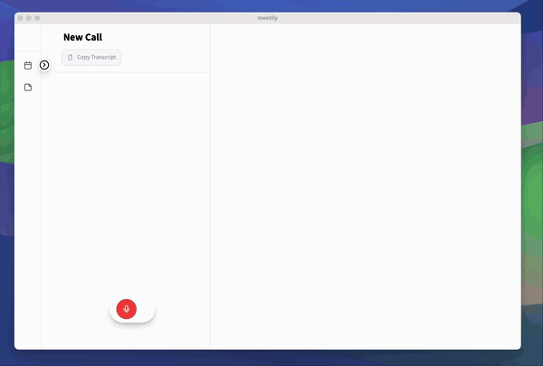
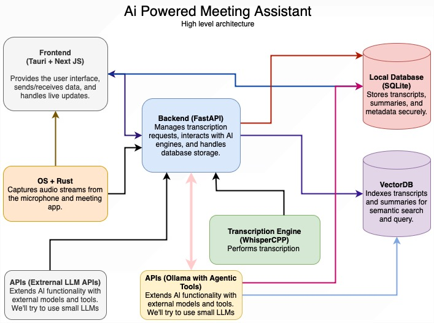

<div align="center" style="border-bottom: none">
    <h1>
        
        <br>
        Meetily - AI-Powered Meeting Assistant
    </h1>
    <br>
    <a href="https://github.com/Zackriya-Solutions/meeting-minutes/releases/tag/v0.0.2"></a>
    <a href="https://github.com/Zackriya-Solutions/meeting-minutes/releases/tag/v0.0.2"></a>
    <a href="https://github.com/Zackriya-Solutions/meeting-minutes/releases/tag/v0.0.2"></a>
    <br>
    <h3>
    <br>
    Open source Ai Assistant for taking meeting notes
    </h3>
    <p align="center">
    <a href="https://meetily.zackriya.com"><b>Website</b></a> •
    <a href="https://in.linkedin.com/company/zackriya-solutions"><b>Author</b></a>
    •
    <a href="https://discord.gg/crRymMQBFH"><b>Discord Channel</b></a>
</p>
    <p align="center">
    
 An AI-Powered Meeting Assistant that captures live meeting audio, transcribes it in real-time, and generates summaries while ensuring user privacy. Perfect for teams who want to focus on discussions while automatically capturing and organizing meeting content without the need for external servers or complex infrastructure. 
</p>

<p align="center">
    
    <br>
    <a href="https://youtu.be/5k_Q5Wlahuk">View full Demo Video</a>
</p>

</div>


## Overview

An AI-powered meeting assistant that captures live meeting audio, transcribes it in real-time, and generates summaries while ensuring user privacy. Perfect for teams who want to focus on discussions while automatically capturing and organizing meeting content.

### Why?

While there are many meeting transcription tools available, this solution stands out by offering:
- **Privacy First**: All processing happens locally on your device
- **Cost Effective**: Uses open-source AI models instead of expensive APIs
- **Flexible**: Works offline, supports multiple meeting platforms
- **Customizable**: Self-host and modify for your specific needs
- **Intelligent**: Built-in knowledge graph for semantic search across meetings

## Features

✅ Modern, responsive UI with real-time updates

✅ Real-time audio capture (microphone + system audio)

✅ Live transcription using Whisper.cpp
✅ Speaker diarization

✅ Local processing for privacy

✅ Packaged the app for Mac Os

🚧 Export to Markdown/PDF


> **Note**: We have a Rust-based implementation that explores better performance and native integration. It currently implements:
> - ✅ Real-time audio capture from both microphone and system audio
> - ✅ Live transcription using locally-running Whisper
> - ✅ Speaker diarization
> - ✅ Rich text editor for notes
> 
We are currently working on:
> - ✅ Export to Markdown/PDF
> - ✅ Export to HTML


## Release 0.0.2

A new release is available!

Please check out the release [here](https://github.com/Zackriya-Solutions/meeting-minutes/releases/tag/v0.0.2).

### What's New
- Transcription quality is improved.
- Bug fixes and improvements for frontend
- Better backend app build process
- Improved documentation
- New `.dmg` package

### What would be next?
- Database connection to save meeting minutes
- Improve summarization quality for smaller llm models
- Add download options for meeting transcriptions 
- Add download option for summary

### Known issues
- Smaller LLMs can hallucinate, making summarization quality poor
- Backend build process require CMake, C++ compiler, etc. Making it harder to build
- Backend build process require Python 3.10 or newer
- Frontend build process require Node.js


## LLM Integration

The backend supports multiple LLM providers through a unified interface. Current implementations include:

### Supported Providers
- **Anthropic** (Claude models)
- **Groq** (Llama3.2 90 B, Deepseek)
- **Ollama** (Local models)

### Configuration
Create `.env` file with your API keys:
```env
# Required for Anthropic
ANTHROPIC_API_KEY=your_key_here  

# Required for Groq 
GROQ_API_KEY=your_key_here

```

## System Architecture



### Core Components

1. **Audio Capture Service**
   - Real-time microphone/system audio capture
   - Audio preprocessing pipeline
   - Built with Rust (experimental) and Python

2. **Transcription Engine**
   - Whisper.cpp for local transcription
   - Supports multiple model sizes (tiny->large)
   - GPU-accelerated processing

3. **LLM Orchestrator**
   - Unified interface for multiple providers
   - Automatic fallback handling
   - Chunk processing with overlap
   - Model configuration:

4. **Data Services**
   - **ChromaDB**: Vector store for transcript embeddings
   - **SQLite**: Process tracking and metadata storage

5. **API Layer**
   - FastAPI endpoints:
     - POST /upload
     - POST /process
     - GET /summary/{id}
     - DELETE /summary/{id}

### Deployment Architecture

- **Frontend**: Tauri app + Next.js (packaged executables)
- **Backend**: Python FastAPI:
  - Transcript workers
  - LLM inference

## Prerequisites

- Node.js 18+
- Python 3.10+
- FFmpeg
- Rust 1.65+ (for experimental features)

## Setup Instructions

### 1. Frontend Setup

#### Run packaged version

Go to the [releases page](https://github.com/Zackriya-Solutions/meeting-minutes/releases) and download the latest version.

Unzip the file and run the executable.

Provide necessary permissions for audio capture and microphone access (Only screen capture permission is required).

#### Dev run

```bash

# Navigate to frontend directory
cd frontend

# Give execute permissions to clean_build.sh
chmod +x clean_build.sh

# run clean_build.sh
./clean_build.sh
```

### 2. Backend Setup

```bash
# Create and activate virtual environment
python -m venv venv
source venv/bin/activate  # Windows: .\venv\Scripts\activate

# Navigate to backend directory
cd backend

# Install dependencies
pip install -r requirements.txt

# Start backend servers
./clean_start_backend.sh
```

## Development Guidelines

- Follow the established project structure
- Write tests for new features
- Document API changes
- Use type hints in Python code
- Follow ESLint configuration for JavaScript/TypeScript

## Contributing

1. Fork the repository
2. Create a feature branch
3. Submit a pull request

## License

MIT License - Feel free to use this project for your own purposes.

Last updated: December 26, 2024

## Star History

[](https://star-history.com/#Zackriya-Solutions/meeting-minutes&Date)
